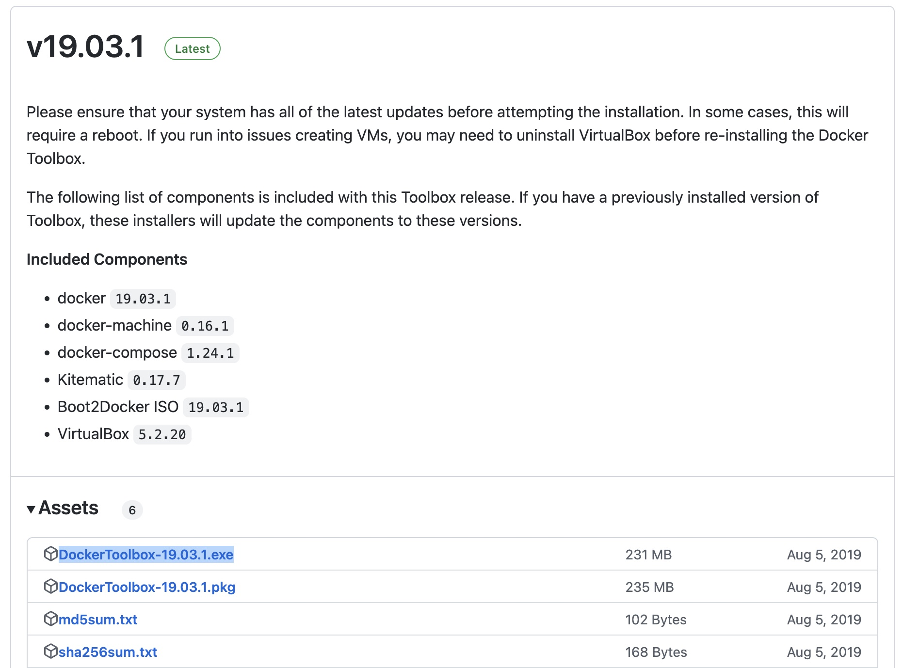
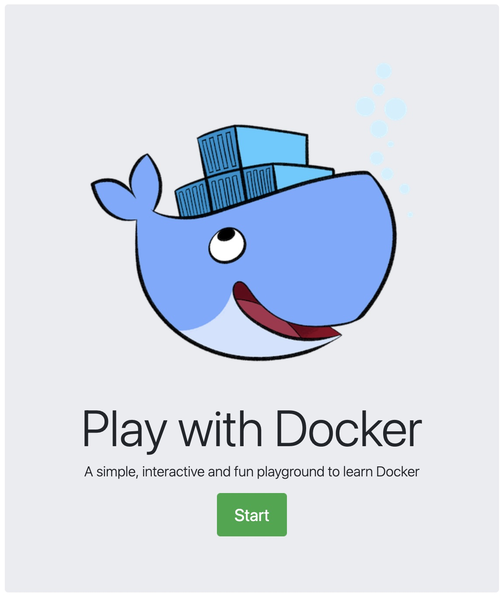
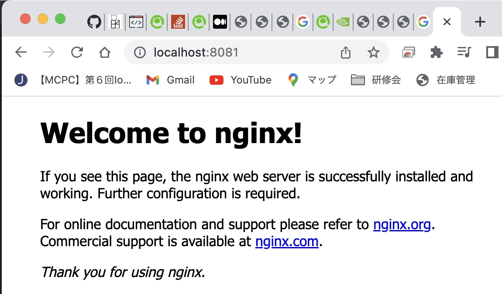
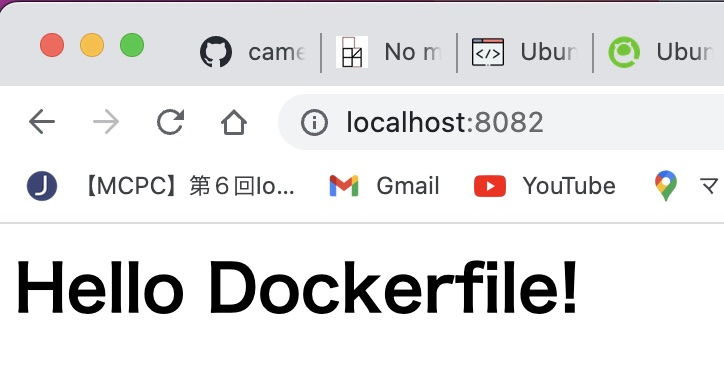

## Docker 座学
###  コンテナとは
  - アプリケーションを隔離されたパッケージ化できるもの。

    

  - Docker以外にも、他にも色々ある（linux Containers/Windows Containers/Hyper-Vコンテナ）が、Docker需要が一番多い。

### Docker用語
  - Dockerfile：Dockerイメージを言語化したもの
  - Dockerイメージ：Dockerコンテナの設計図。Dockerfileをビルドして作成するか、Docker Hubからダウンロードして入手する。
  - Dockerコンテナ：実環境でDockerイメージからロードされた環境そのもの。

## Dockerインストール
### Windows
  - Windows設定の「アプリと機能」から、右上の「プログラムと機能」を選択した後、「Windowsの機能の有効化または無効化」を選んで、次の機能をOFFにしておくこと。

    - Hyper-V

    - Linux 用 Windows サブシステム
 
    - Windows ハイパーバイザープラットフォーム

  - Docker Toolbox for Windowsには、VirtualBoxが内包されているが、バージョンが古いためか、うまく動作しないため、先に最新のVirtualBoxをインストールする。[こちらの公式サイト](https://www.oracle.com/jp/virtualization/technologies/vm/downloads/virtualbox-downloads.html)から最新のリリースをダウンロードしてインストールすること。


  - Docker Toolbox for Windowsを、Githubからダウンロードを行う。

     [https://github.com/docker-archive/toolbox/releases](https://github.com/docker-archive/toolbox/releases)

     

  - ダウンロードしたファイルは、保護されている可能性があるので、一度プロパティで保護状況を確認して、保護状態の場合は、解除する。

  - 「DockerToolbox-19.03.1.exe」をクリックしてダウンロードする。ダウンロード後、ダブルクリックで、インストール開始。Virtual Boxはインストールの選択から外すこと。

  - インストールが終わったら、デスクトップにできたアイコン「Docker Quickstart Terminal」をダブルクリックする。

### Play with docker
環境がどうしても構築できない場合は、こちらの[「Play with Docker」サイトで](https://labs.play-with-docker.com/)、クラウドサービスとしてDockerを試すことができる。


## Docker基本操作

### docker run

- dockerイメージをロードするコマンド。指定イメージをDocker Hubからダウンロードして実行する。
  - 例）
    ```sh
    docker run hello-world
    ```
- '--name [イメージ名]'でコンテナに名前をつける
- '--rm'をつけると、コンテナを残さないで起動させることができる。
  - 例）
    ```sh
    docker run --name test_image --rm hello-world
    ```
- '-it'をつけると、コンテナ内に入る。
  - 例）
    ```sh
    docker run --name mycentos -it centos:8 /bin/bash

    [root@bcff87ab78e1 /]# ls
    bin  dev  etc  home  lib  lib64  lost+found  media  mnt  opt  proc  root  run  sbin  srv  sys  tmp  usr  var

    [root@bcff87ab78e1 /]# exit
    ```

- '-v ホストパス:コンテナパス'をつけると、ストレージをホストと共有する（後述）
- '-p ホストポート:コンテナポート'をつけると、ポートフォワーディングする（後述）
- '-d'をつけると、バックエンド起動となる（後述）

### docker ps

- 起動中のdockerコンテナを表示するコマンド

  - '-a'オプションをつけると過去に終了したイメージも表示される。

### docker start/stop/restart

- コンテナの起動を制御するコマンド群。
  - 例）
    ```sh
    # コンテナを起動
    docker restart mycentos 
    ```

### docker exec

- コンテナに対してコマンドを実行する。
  - 例1）コンテナに入る
    ```sh
    # コンテナを起動（起動するだけ）
    docker restart mycentos

    # bashを起動（入力モードになる）
    docker exec -it mycentos /bin/bash

    [root@bcff87ab78e1 /]# cat /etc/redhat-release
    CentOS Linux release 8.4.2105

    [root@bcff87ab78e1 /]# exit
    ```

  - 例2）コンテナに入らずに実行
    ```sh
    # コンテナを起動（起動するだけ）
    docker restart mycentos
    # bashを起動（入力モードになる）
    docker exec mycentos cat /etc/redhat-releast

    CentOS Linux release 8.4.2105
    ```

### docker rm

- 停止中のコンテナを削除する
  - '-f'をつけると、稼働中のコンテナを強制的に削除することもできる。

  - 例）
    ```sh
    # コンテナを削除
    docker rm mycentos 
    ```

### docker images

- ローカルにあるdockerイメージを表示する。
  - 例）
    ```sh
    # dockerイメージを一覧表示
    docker images 

    REPOSITORY    TAG       IMAGE ID       CREATED         SIZE
    hello-world   latest    46331d942d63   9 months ago    9.14kB
    centos        8         e6a0117ec169   15 months ago   272MB
    ```

### docker rmi

- ローカルにあるdockerイメージを削除する。
- コンテナ起動済みのイメージは削除できないため、事前にrmiで削除しておくこと。
- rmiと異なり、コンテナ名ではなく、イメージIDを指定する。
  - 例）
    ```sh
    # dockerイメージを一覧表示
    docker images 

    REPOSITORY    TAG       IMAGE ID       CREATED         SIZE
    hello-world   latest    46331d942d63   9 months ago    9.14kB
    centos        8         e6a0117ec169   15 months ago   272MB

    # dockerイメージを削除
    docker rmi e6a0117ec169

    Untagged: centos:8
    Untagged: centos@sha256:a27fd8080b517143cbbbab9dfb7c8571c40d67d534bbdee55bd6c473f432b177
    Deleted: sha256:e6a0117ec169eda93dc5ca978c6ac87580e36765a66097a6bfb6639a3bd4038a
    ```

### docker build
- Dockerfileから、イメージを作成するコマンド

  - 例）  
    Dockerfile（[/assets/Dockerfile/sample/Dockerfile](/assets/Dockerfile/sample/Dockerfile)）
    ```docker
    FROM centos:7
    RUN yum update -y
    ```

    command
    ```sh

    # dockerイメージを作成
    docker build assets/Dockerfile/sample/Dockerfile
    [+] Building 0.9s (6/6) FINISHED   0.0s
    # 中略
    => writing image sha256:e2a7d731e2c63f7a8aa18d197da2ce573f9762195474e8fa5b7947b5bbf90d7a  0.0s

    # dockerイメージを一覧表示
    docker images
    REPOSITORY   TAG       IMAGE ID       CREATED         SIZE
    <none>       <none>    e2a7d731e2c6   12 months ago   1.09GB    
    ```

### docker cp
- コンテナとホストマシンでファイルのやりとりを行うコピーコマンド
  - ホスト→コンテナへファイルをコピー
    - 構文：docker cp [コピー元ファイル] [コピー先コンテナ名]:[コンテナ内パス]
    - 例）
        ```sh
        docker cp localfile.txt mycentos:~/
        ```
  - コンテナ→ホストへファイルをコピー
    - 構文：docker cp [コピー元コンテナ名]:[コンテナ内のファイルパス] [コピー先パス]
    - 例）
        ```sh
        docker cp mycentos:~/continerfile.txt ./
        ```

### docker logs
- コンテナ内のログを出力する。
  - '-f'オプションでリアルタイムログを出力する。
  - '-t'オプションでタイムスタンプも併せて表示する。
  - デフォルトでは、STDOUT、STDERRが出力される。
  - 例）
      ```sh
      docker logs -t -f mycentos
      ```

### docker inspect
- dockerの詳細を確認するコマンド。主要な項目は、以下のコメント部を参照。
  - 例）
      ```sh
      docker inspect mycentos

        [
            {
                "Id": 
                "State": {
                    # コンテナの状態
                    "Status": "running",
                    "Running": true,
                },
                "Image": 
                "HostConfig": {
                },
                "GraphDriver": {
                },
                "Mounts": [],  # ドライブのマウント状態
                "Config": {
                    # 環境変数
                    "Env": [
                        "PATH=/usr/local/sbin:/usr/local/bin:/usr/sbin:/usr/bin:/sbin:/bin"
                    ],
                    # 実行されるコマンド
                    "Cmd": [
                        "/bin/bash"
                    ],
                    "Image": "centos:8",
                },
                "NetworkSettings": {
                    "Networks": {
                        # ネットワーク情報
                        "bridge": {
                            # IPアドレス
                            "IPAddress": "172.17.0.2",
                            "IPPrefixLen": 16,
                        }
                    }
                }
            }
        ]
      ```

### docker pull
- docker hubからダウンロードする。docker runでも兼ねられるが、プライベートリポジトリから取得する場合はこちらを使う。
  - 例）
    ```sh
    docker pull camelrush/jenkins:2.150.2
    ```


### docker commit
- コンテナをイメージ化するコマンド。
  - 例）
    ```sh
    docker commit mycentos camelrush/mycentos:v1

    # イメージを表示
    docker images

    REPOSITORY           TAG       IMAGE ID       CREATED          SIZE
    camelrush/mycentos   v1        3442b73924cb   14 seconds ago   272MB
    ```

### docker push
- ローカルの dockerイメージを、Docker Hubのプライベートレポジトリにアップロードする。
- あらかじめ、docker loginでDocker Hubにログインしていることが前提となる。
  - 例）
    ```sh
    docker push camelrush/mycentos:v1

    The push refers to repository [docker.io/camelrush/mycentos]
    b8b639080fd4: Pushed 
    d871dadfb37b: Mounted from library/centos 
    v1: digest: sha256:03e457e3ddea3b0cd487a01686bb8d7d7e0c0190313481b0394d285a768db328 size: 736
    ```
  - アップロード後のDocker Hub画面
    

### docker history
- dockerイメージの作成履歴を確認する。
  - 例）
    ```sh
    # 参考イメージを取得する。
    docker pull mongo-express

    # イメージの履歴を確認する。
    docker history mongo-express:latest

    IMAGE          CREATED         CREATED BY                                      SIZE      COMMENT
    4475769c9d8b   5 weeks ago     /bin/sh -c #(nop)  CMD ["mongo-express"]        0B        
    <missing>      5 weeks ago     /bin/sh -c #(nop)  ENTRYPOINT ["tini" "--" "…   0B        
    <missing>      5 weeks ago     /bin/sh -c cp config.default.js config.js       8.58kB    
    <missing>      5 weeks ago     /bin/sh -c #(nop) WORKDIR /node_modules/mong…   0B        
    <missing>      5 weeks ago     /bin/sh -c #(nop) COPY file:4835df10525ec6f1…   1.17kB    
    <missing>      5 weeks ago     /bin/sh -c set -eux;  apk add --no-cache --v…   48.2MB    
    <missing>      5 weeks ago     /bin/sh -c #(nop)  ENV MONGO_EXPRESS=1.0.0-a…   0B        
    <missing>      5 weeks ago     /bin/sh -c #(nop)  ENV ME_CONFIG_EDITORTHEME…   0B        
    <missing>      5 weeks ago     /bin/sh -c #(nop)  EXPOSE 8081                  0B        
    <missing>      5 weeks ago     /bin/sh -c apk add --no-cache bash tini         1.95MB    
    <missing>      14 months ago   /bin/sh -c #(nop)  CMD ["node"]                 0B        
    <missing>      14 months ago   /bin/sh -c #(nop)  ENTRYPOINT ["docker-entry…   0B        
    <missing>      14 months ago   /bin/sh -c #(nop) COPY file:4d192565a7220e13…   388B      
    <missing>      14 months ago   /bin/sh -c apk add --no-cache --virtual .bui…   7.7MB     
    <missing>      14 months ago   /bin/sh -c #(nop)  ENV YARN_VERSION=1.22.15     0B        
    <missing>      14 months ago   /bin/sh -c addgroup -g 1000 node     && addu…   75.9MB    
    <missing>      14 months ago   /bin/sh -c #(nop)  ENV NODE_VERSION=12.22.7     0B        
    <missing>      16 months ago   /bin/sh -c #(nop)  CMD ["/bin/sh"]              0B        
    <missing>      16 months ago   /bin/sh -c #(nop) ADD file:da6c0ac7cb9f81999…   5.37MB    


## コンテナのストレージ
講師の内容は[こちらのGithub](https://github.com/uchidayuma/udemy-docker.git)に格納されているので参照する。

### docker run -v
- コンテナにボリュームをマウントする。
- '-v'オプションは、'--name'よりも前に配置すること。
- マウントさせるパスは、相対アドレスは指定できない？絶対アドレスで指定すること。
  - 構文）docker run -v /[ホストのパス]:[コンテナ内のパス] [イメージ名]

  - 例）
    ```sh
    # ホストのストレージ（/tmp/test）を、コンテナストレージ（/tmp/test）にマウントして
    docker run -it -v /var/test:/home/root/test --name mycentos centos:8 /bin/bash
    ```

### nginxを使用した環境
- '-p'オプションを指定することで、ポートの変換ができる。

  - 構文）docker run -v /[ホストのパス]:[コンテナ内のパス] [イメージ名]

  - 例）  
    index.html（[/assets/html/sample01/index.html](/assets/html/sample01/index.html)）
    ```
    <h1>docker -v option</h1>
    ```

    command
    ```sh
    # ホストのストレージ（/tmp/test）を、コンテナストレージ（/tmp/test）にマウントして
    docker run -v /Users/shinya.takada/Workspace/docker_study/assets/html/sample01/:/usr/share/nginx/html --name mynginx -p 8080:80 nginx:1.16
    ```

## Dockerfileの構築

### ベストプラクティス
- [ガイドラインはこちら](https://docs.docker.jp/develop/develop-images/dockerfile_best-practices.html)
- ポイントは以下。
  - コンテナはエフェメラル（=ステートレス）であるべき。停止・破棄可能であること。
  - .dockerignoreファイルを作成し、余分なファイルを置かないこと。
  - 不要なパッケージのインストールを避ける。極力シンプルにする。
  - コンテナ一つにつき、一つのプロセスに設計して、分けるべきである。
  - 複数行の引数は、バックスラッシュで区切ること。
    ```sh
    # 複数のラベルを一度に設定、ただし行継続の文字を使い、長い文字列を改行する
    LABEL vendor=ACME\ Incorporated \
        com.example.is-beta= \
        com.example.is-production="" \
        com.example.version="0.0.1-beta" \
        com.example.release-date="2015-02-12"
    ```

### RUNとCMD
- どちらもコンテナに対する実行命令である。違いは実行タイミング。
  - RUNは、docker buildで、１回だけ実行されるもの。
  - CMDは、docker runで、コンテナ化するときに実行されるもの。
  - 例）
    ```docker
    RUN apt-get install -y nginx
    CMD ["nginx", "-g", "daemon off"]
    ```
  - CMDは3つの記載形式がある。上は、一番上のもの。詳細は[こちらを参照](https://docs.docker.jp/engine/reference/builder.html#cmd)。
    
  - 文字の区切りは、シングルクォーテーションではなく、ダブルクォーテーションで区切ること。

  - 演習）  
    Dockerfile（[assets/Dockerfile/sample-run/Dockerfile](assets/Dockerfile/sample-run/Dockerfile)）
    ```docker
    FROM ubuntu:20.04
    RUN apt-get update -y && \
        apt-get install -y nginx
    CMD ["nginx", "-g", "daemon off;"]
    ```
    command(build)
    ```sh
    docker build -t dockerfile-run-nginx ./Dockerfile/sample-run/
    ```
    command(run)
    ```sh
    # -d オプションで、バックエンド起動
    docker run -d -p 8081:80 --name dockerfile-run-nginx dockerfile-run-nginx
    ```

    ブラウザで、8081ポートへアクセスすると、nginxのトップページが表示される。
    

### COPYとADD
- コンテナにホストのファイルをコピーする。
  - ADDの方が機能が豊富で、tar等の解凍も可能。だが、ベストプラクティスとしてはCOPYを推奨（必要がないなら、シンプルな命令を使うのがポリシーらしい）
  - 演習）  
    Dockerfile（[assets/Dockerfile/sample-copy/Dockerfile](assets/Dockerfile/sample-copy/Dockerfile)）
    ```docker
    FROM ubuntu:20.04
    RUN apt-get update -y && \
        apt-get install -y nginx
    COPY index.html /var/www/html
    CMD ["nginx", "-g", "daemon off;"]
    ```
    index.html
    ```html
    <h1>Hello Dockerfile!</h1>
    ```
    command(build)
    ```sh
    docker build -t dockerfile-copy-nginx ./Dockerfile/sample-copy/
    ```
    command(run)
    ```sh
    # -d オプションで、バックエンド起動
    docker run -d -p 8082:80 --name docker-copy-nginx dockerfile-copy-nginx
    ```

    ブラウザで、8082ポートへアクセスすると、copyしたindex.htmlが表示される。
    